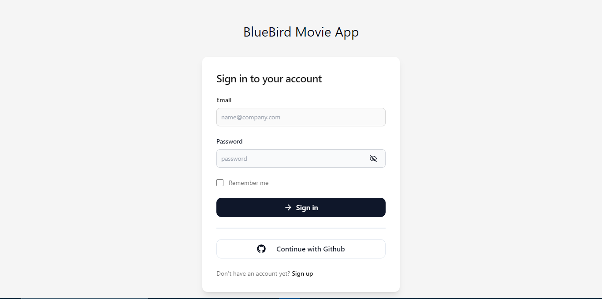
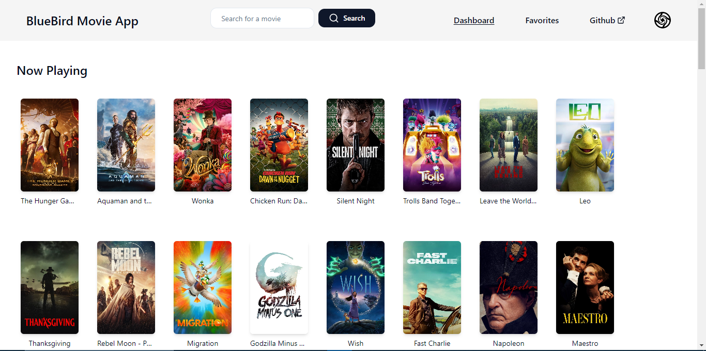
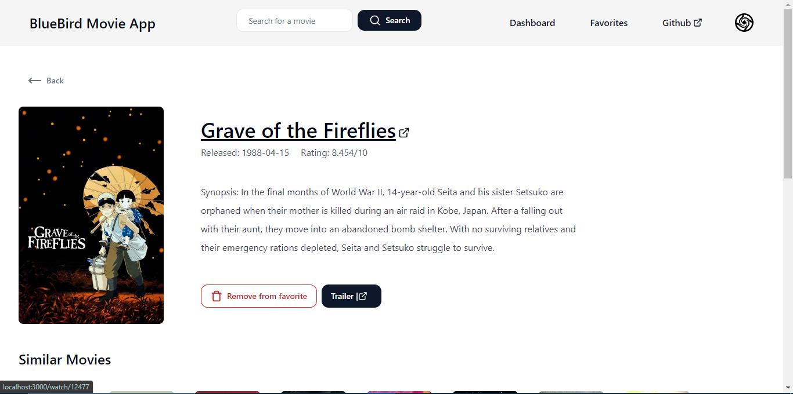
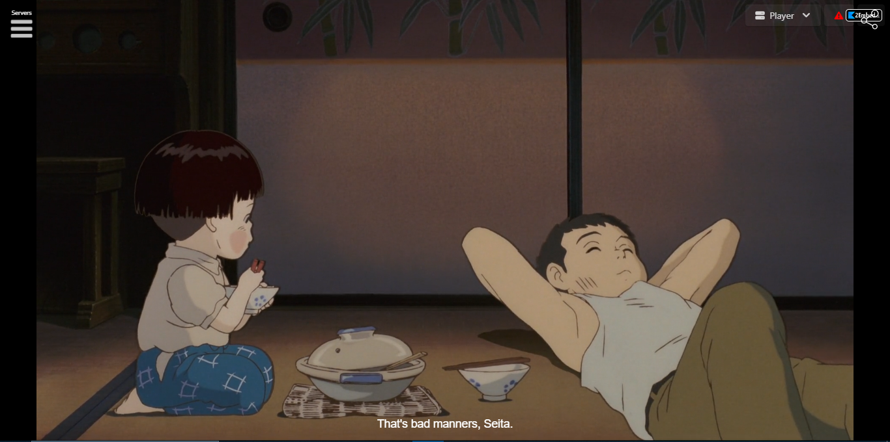

# BlueBird Movies

Welcome to BlueBird Movies, a cutting-edge movie streaming application designed to redefine your cinematic experience. Explore the world of movies with advanced features, seamless navigation, and a robust tech stack that ensures both performance and scalability.

## Table of Contents

1. [Introduction](#introduction)
1. [Screenshots](#screenshots)
2. [Features](#features)
3. [Tech Stack](#tech-stack)
4. [Installation](#installation)
5. [Usage](#usage)
6. [Authentication](#authentication)
7. [Database Management](#database-management)
8. [Movie Playback](#movie-playback)
9. [Testing](#testing)
10. [Codebase Overview](#codebase-overview)
11. [API Documentation](#api-documentation)
12. [Contributing](#contributing)
13. [Environment Variables](#environment-variables)
14. [License](#license)

## Introduction

Welcome to the BlueBird Movies project, an innovative web application designed to elevate your movie streaming experience. Harnessing the capabilities of React, TypeScript, and Next.js, this modern application seamlessly integrates server-side rendering and static site generation to deliver a dynamic and responsive user interface.

### Technologies at Your Fingertips

Our tech stack includes cutting-edge tools such as Prisma, a next-generation ORM for Node.js and TypeScript, ensuring efficient and error-resistant database access. With Prisma, developers can enjoy a clean and type-safe approach to managing data, resulting in faster development cycles and fewer errors.

Tailwind CSS, a utility-first framework, empowers the creation of custom user interfaces with unparalleled speed. This utility-centric styling approach, embedded in our application, allows for flexible and efficient design without compromising the integrity of your HTML.

The inclusion of Redis as an in-memory data structure store further enhances performance, serving as a versatile solution for database operations, caching, and messaging. With support for various data structures and advanced functionalities, Redis optimizes the application's responsiveness and scalability.

### Development Environment

Built with best practices in mind, our project incorporates ESLint for effective code linting, Prettier for code formatting, and Jest for robust testing. This ensures a codebase that not only meets industry standards but also provides a foundation for seamless collaboration and future enhancements.

### npm at the Helm

The project is managed through npm, the default package manager for Node.js. npm streamlines the process of installing and managing project dependencies, offering a straightforward and efficient approach to package management in the JavaScript ecosystem.

### Scalability and Maintainability

The BlueBird Movies project is architected for scalability and maintainability. Whether you are contributing to the codebase or exploring its intricacies, this documentation serves as your comprehensive guide to understanding the project's structure, features, and the principles that underpin its development. Elevate your movie streaming experience with BlueBird Movies – where technology meets cinematic entertainment.

## Screenshots

Here are some screenshots showcasing different aspects of the project:

### Login/Signup



### Dashboard



### Favorites


### Movie Detail Page



### Movie Player Page



### Movie Player Page (Full Screen)


## Features

BlueBird Movies comes packed with features to enhance your movie streaming journey:

- **TMDB Integration:** Explore a vast collection of movies seamlessly integrated with The Movie Database (TMDB) API.
- **User Authentication:** Securely authenticate using GitHub OAuth, ensuring a personalized and secure experience.
- **Favorites:** Save your favorite movies by storing them in the PostgreSQL database.
- **Trailer Preview:** Watch trailers before deciding to dive into a movie.
- **2embed.cc Integration:** Enjoy smooth and uninterrupted movie playback using the 2embed.cc player.
- **Responsive UI:** A responsive and intuitive user interface designed for a seamless experience across devices.

Stay tuned for more exciting features as we continue to enhance BlueBird Movies.

## Tech Stack

BlueBird Movies leverages a powerful tech stack to deliver a seamless movie streaming experience:

- **React:** A JavaScript library for building user interfaces.
- **TypeScript:** A statically typed superset of JavaScript for enhanced developer productivity.
- **Next.js:** A React framework for server-side rendering and static site generation.
- **Prisma:** An ORM for Node.js and TypeScript, ensuring efficient and type-safe database access.
- **Tailwind CSS:** A utility-first CSS framework for rapid UI development.
- **Redis:** An in-memory data structure store for caching, database, and messaging needs.
- **Jest:** A JavaScript testing framework for robust test suites.
- **ESLint and Prettier:** Tools for code linting and formatting, ensuring code quality.
- **PostgreSQL:** A powerful, open-source relational database system.
- **NeonDB:** Cloud PostgreSQL instance for seamless database management.

## Installation

To set up BlueBird Movies locally, follow these steps:

1. Clone the repository.
2. Run `npm install` to install dependencies.
3. Create a [.env](.env) file with the specified environment variables (see [Environment Variables](#environment-variables)).
4. Start the development server with `npm run dev`.
5. Open `localhost:3000` in your browser to view the application.

## Usage

Navigate through BlueBird Movies effortlessly and make the most of its features:

- **Home Page:** Explore the movie collection seamlessly integrated with TMDB.
- **Authentication:** Log in securely using GitHub OAuth to unlock personalized features.
- **Favorites:** Save your preferred

 movies to the PostgreSQL database for quick access.
- **Trailer Preview:** Watch movie trailers to make informed viewing decisions.
- **Movie Playback:** Enjoy uninterrupted movie playback with the 2embed.cc player.
- **Responsive Design:** Experience a fluid and responsive user interface across devices.

## Authentication

BlueBird Movies ensures secure user authentication through GitHub OAuth. By integrating GitHub authentication, the application offers a seamless and trustworthy login experience.

To set up authentication, obtain your GitHub OAuth credentials by creating a new OAuth App in your GitHub account. Update the [.env](.env) file with your GitHub client ID and client secret.

## Database Management

BlueBird Movies relies on PostgreSQL for efficient database management. Store your favorite movies securely in the database, providing a personalized and persistent user experience.

To set up the PostgreSQL database, follow the instructions provided in the [.env](.env) file. Ensure the specified `DATABASE_URL` and `DATABASE_URL_NON_POOLING` variables are configured correctly.

## Movie Playback

Enjoy smooth and uninterrupted movie playback with BlueBird Movies. The application integrates with the 2embed.cc player, offering a reliable and feature-rich streaming experience.

Simply navigate to the movie of your choice and experience seamless playback directly within the application.

## Testing

Ensure the reliability of BlueBird Movies by running tests with Jest. Execute the following command to run the test suites:

```bash
npm run test
```

This ensures that the application functions as expected, maintaining a high standard of quality and performance.

## Codebase Overview

Explore the project's codebase to understand its structure and key files:

- **src:** Contains the source code of the application.
- **public:** Holds static files served by the server.
- **prisma:** Includes the Prisma schema and migration files for database management.
- **__tests__:** Contains test files to validate application functionality.
- **.next:** Generated directory during the build process, containing the built application.
- **.swc:** Directory with plugins for the SWC JavaScript/TypeScript compiler.
- **redis-server:** Includes the Redis server and related files.

## API Documentation

BlueBird Movies does not expose external APIs. The application communicates with the TMDB API for movie data retrieval, enhancing the user experience with a diverse and up-to-date movie collection.

## Contributing

We welcome contributions to BlueBird Movies. If you're interested in contributing, please follow these guidelines:

- Submit pull requests for feature enhancements or bug fixes.
- Report issues or bugs through the GitHub issue tracker.
- Maintain code consistency and follow established coding standards.
- Collaborate with the community to enhance the overall project.

We appreciate your contributions and value your commitment to improving BlueBird Movies.

## Environment Variables

Configure the [.env](.env) file to set up the necessary environment variables for local development. Update the file with your specific values for the following variables:

- **DATABASE_URL:** PostgreSQL database connection string.
- **DATABASE_URL_NON_POOLING:** PostgreSQL connection string without connection pooling.
- **NEXTAUTH_SECRET:** Secret key for Next.js authentication.
- **NEXTAUTH_URL:** Application URL for Next.js authentication.
- **GITHUB_CLIENT_ID:** GitHub OAuth client ID.
- **GITHUB_CLIENT_SECRET:** GitHub OAuth client secret.
- **REDIS_URL:** Connection string for the local Redis server.
- **TMDB_API_KEY:** API key for The Movie Database (TMDB).

Ensure that the values provided for each variable are accurate and reflect your local development environment.

## License

This project is licensed under the [MIT License](LICENSE). Feel free to explore, modify, and contribute while adhering to the terms of the license.

Thank you for choosing BlueBird Movies for your cinematic journey! For additional questions or support, please reach out to the project maintainers.